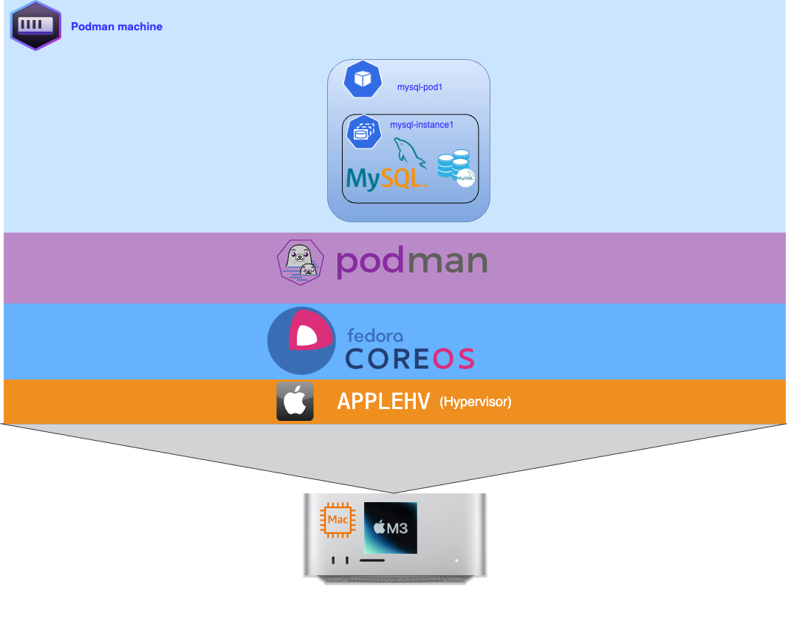

##  Introduction to MySQL for Beginners

Exploring one of the world’s most popular database management systems. This session is not a full training but rather an introduction to the essential concepts and features of MySQL.


## Prerequisites
Before you get started, you’ll need to have these things:
- podman installed
- mysqlshell installed
- mysql client installed
  

## Architecture





## Setup environnement

We will first create a podman network for our environment.

Create a Custom Network:
```bash

:> podman network create --subnet 10.87.0.0/24 mysqlsrv
mysqlsrv
:>
```

### Deploy MySQL Using Podman

Downloading Docker images before running them offers several key advantages. It ensures version control, providing consistency across deployments. By storing images locally, it improves the reliability and availability of containers, even if the network or registry is down. This approach also enables faster startups, as there’s no delay waiting for downloads. Additionally, it optimizes network usage and allows for security scanning of images before execution, ensuring secure and uninterrupted deployments.

✅ Download the MySQL Image:

```bash

:> podman  pull container-registry.oracle.com/mysql/enterprise-server:9.0.1-aarch64
:>
```

> Here, we download the Enterprise version, but you can replace it with the [Community version](https:/hub.docker.com/_/mysql): docker pull mysql:9

✅ Creating persistent volume
We will create three persistent volumes for MySQL instance :

```bash

:> podman volume create vdemodb01
:>
```


✅ Create a Pods:
We'll create a pod for MySQL instance. Run the following command to create a pod:

```bash

:> podman pod create --name mysql9-pod1 -p 3306:3306 --network mysqlsrv
:>
```

✅ We expose the port for MySQL instance.

Check Pod instance run :
```bash
:>
:> podman pod ls
POD ID        NAME         STATUS      CREATED             INFRA ID      # OF CONTAINERS

2741f23813ee  mysql9-pod1   Created     5 seconds ago      a9e97cfba6cf  1
:>
```

✅ Create a secret

We're going to create a secret to store the root user's password:

```bash

:> export DBPASS="XXXX"
:> podman secret create --env MYSQL_ROOT_PASSWORD DBPASS
:>
````

This will create a secret named **MYSQL_ROOT_PASSWORD**

✅ Check if a secret is created :

```bash

:> podman secret ls
ID                         NAME    DRIVER   CREATED         UPDATED
3c8c07ead697c08ce81d84f29  DBPASS  file     11 seconds ago  11 seconds ago
:>
```


✅ Creation of a **my.cnf** configuration file , which we will mount as a volume.

```toml
[mysqld]
host-cache-size=0
skip-name-resolve
datadir=/var/lib/mysql
socket=/var/lib/mysql/mysql.sock
secure-file-priv=/var/lib/mysql-files
user=mysql

pid-file=/var/run/mysqld/mysqld.pid
server_id=1
enforce_gtid_consistency=ON
gtid_mode=ON
report_host = 'mysql9-instance-1'

```

✅ Creation of a **init.sql** init file which will be executed the first time the MySQL intance is started. In this script we create the **root** user with the right permissions .

❗️ Don’t forget to change the password in the **init.sql** file.

```sql
:SQL> CREATE USER 'root'@'%' IDENTIFIED BY 'XXXX'; 
GRANT ALL PRIVILEGES ON *.* TO 'root'@'%' WITH GRANT OPTION;
FLUSH PRIVILEGES;
:SQL>
```

✅ Run MySQL Instance:
Start three MySQL instance in the created pod. Use the --pod option to specify the pod for a container.

❗️ Before running the container, you need to generate the certificates in the ssl directory by executing the following script:
```bash
./generate_ssl_certif.sh
```


```bash

:> export INITSQL=$HOME/Documents/App/mysql-pod/initdb/init.sql
:> export CONFIG=$HOME/Documents/App/mysql-pod/config
:> export CERT=$HOME/Documents/App/mysql-pod/ssl
:>
:> podman run --name mysql9-instance-1 --pod mysql9-pod1 --network mysqlsrv --ip 10.87.0.30 \ 
--secret MYSQL_ROOT_PASSWORD,type=env \
-v $CERT:/etc/my.cnf.d/certs/:ro \
-v pvcdb1:/var/lib/mysql -v $INITSQL:/docker-entrypoint-initdb.d/init.sql \
-v $CONFIG/1/my.cnf:/etc/my.cnf -d container-registry.oracle.com/mysql/enterprise-server:9.0.1-aarch64 \ 
--bind-address=10.87.0.30
:>
```

✅ Check MySQL instances run :

```bash

:> podman ps |gre mysql-instance

059e46071ad6  container-registry.oracle.com/mysql/enterprise-server:9.0.1-aarch64 mysqld 5 mn ago Up 5 minutes 0.0.0.0:3306->3306/tcp  mysql9-instance-1
:>
```

✅ Check a connexion on MySQL instances run :

```bash

:>  mysqlsh -uri root@10.87.0.30
:>
```


✅  Deployment of an application 


This application creates a **mydb** database with a user **app** and deploys an application pod called **ecommerce-platform.**


 Create a sample database (mydb) and load data

Run this command:
```bash

:> mysql -u root -h 10.87.0.30  -p < Database/DB_SCRIPT.sql
:>
```

✅ Create a new user for database mydb

Run this command:
```bash

:> mysql -u root -h 10.87.0.30  -p < Database/create_user.sql
:>
```
This sql script creates an app user with a password , modify this script to change the user name and password.

Connect to server to check if the mydb database has been ready :

```bash

:> mysql -u app -h 10.89.0.30 -p mydb -e "SHOW TABLES;"
+-------------------+
| Tables_in_mydb    |
+-------------------+
| address           |
| buyer             |
| buyerorder        |
| order_has_product |
| orderreturns      |
| payment           |
| product           |
| review            |
| shoppingcart      |
| supplier          |
| user              |
| user_log          |
| wishlist          |
+-------------------+
:>
```

Our application database is deployed and accessible. We can now deploy our application.


**Create a Pod for our application**
```bash

podman pod create --name app -p 5001:5000 --network mysqlsrv


```

We will create a Secrets for the password (MYSQL_PASSWORD and MYSQL_ROOT_PASSWORD).

**Secret creation:**
```bash

PASSWD="XXXX"
echo $PASSWD | podman secret create MYSQL_ROOT_PASSWORD -
PASSWD1="XXXX"
echo $PASSWD | podman secret create MYSQL_PASSWORD -
:>

```


**Run application**:
```bash

podman run --name ecommerce --pod app --network mysqlsrv --ip 10.87.0.20 --secret MYSQL_ROOT_PASSWORD,type=env -e MYSQL_ROOT_USER=root -e MYSQL_HOST=mysql-router1 -e MYSQL_PORT=6446 -e MYSQL_DATABASE=mydb -e MYSQL_USER=app -secret MYSQL_PASSWORD,type=env -d  mcolussi/ecommercep:1.0.1

```

Check if the application is successfully deployed :

```bash

:> podman ps --filter "name=ecommerce" --format "table {{.Names}}\t{{.Status}}"
NAMES       STATUS
ecommerce   Up 3 minutes
:>
 
```

The application  is up 😀,we can connect to the external address of the service (10.89.0.20) on port 5000:
http://10.89.0.20:5000


## ✅ Conclusion

In conclusion, MySQL is a powerful and versatile tool for database management, whether for personal or professional projects. We covered essential topics such as choosing between the Community and Enterprise editions, installation on different systems, and common errors you might encounter.

I encourage you to explore more available resources and practice with MySQL to strengthen your skills. Don’t hesitate to ask questions or look for solutions in the official documentation.

Good luck with your MySQL projects! 😀

❗️ You can find the presentation in both PowerPoint and PDF formats in the *presentation-ppt-FR* directory, and the scripts used are located in the *scripts* directory. The deployment of the test application is available in the *app* directory.

---
## ✅ Ressources


▶️ [Deploying MySQL on Linux with Docker Containers](https://dev.mysql.com/doc/refman/9.0/en/linux-installation-docker.html)

▶️ [Reference Manual](https://dev.mysql.com/doc/refman/9.1/en/)

▶️ [Editions](https://www.mysql.com/products/)

▶️ [Webinar video](https://go.oracle.com/LP=127708)

---
<table>
<tr style="border: 0px transparent">
	<td style="border: 0px transparent"><a href="../README.md" title="home">🏠</a></td>
</tr>
</tr>

</table>
