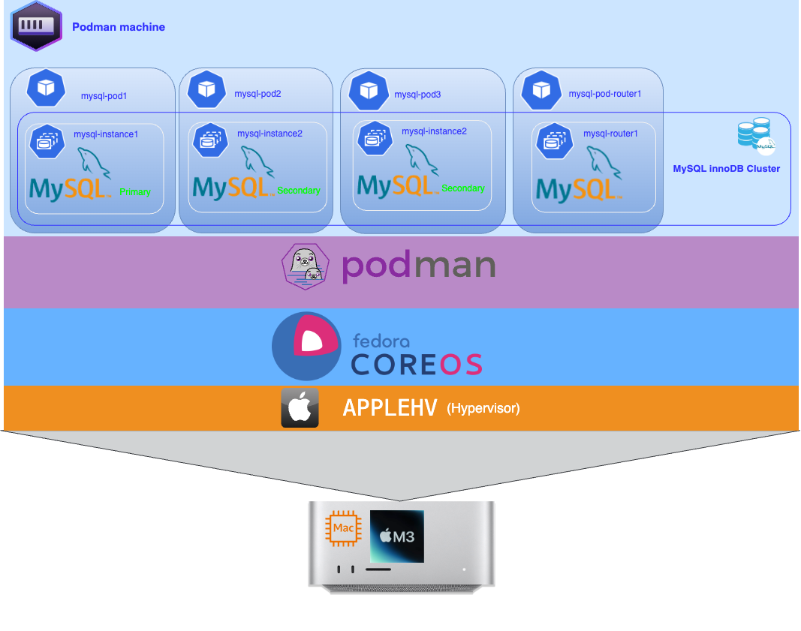

##  MySQL High Availability, Scalability and Disaster Recovery

MySQL High Availability, Scalability and Disaster Recovery
This presentation provides comprehensive guidance on establishing a high availability (HA) and disaster recovery (DR) framework within your enterprise, leveraging the robust capabilities of MySQL. It will also explain how to effectively scale your MySQL applications.


## Prerequisites
Before you get started, you’ll need to have these things:
- podman installed
- mysqlshell installed
- mysql client installed
  

## Architecture





## Setup environnement

We will first create a podman network for our environment.

Create a Custom Network:
```bash

:> podman network create --subnet 10.87.0.0/24 mysqlsrv
mysqlsrv
:>
```

### Deploy MySQL InnoDB Cluster Using Podman

Downloading Docker images before running them offers several key advantages. It ensures version control, providing consistency across deployments. By storing images locally, it improves the reliability and availability of containers, even if the network or registry is down. This approach also enables faster startups, as there’s no delay waiting for downloads. Additionally, it optimizes network usage and allows for security scanning of images before execution, ensuring secure and uninterrupted deployments.

✅ Download the MySQL and MySQL Router Image:

```bash

:> podman  pull container-registry.oracle.com/mysql/enterprise-server:9.4.0-aarch64
:> podman pull container-registry.oracle.com/mysql/enterprise-router:9.4.0-aarch64 
:>
```

✅ Creating persistent volume
We will create three persistent volumes for each MySQL instance :

```bash

:> podman volume create pvcdb1
:> podman volume create pvcdb2
:> podman volume create pvcdb3
:>
```


✅ Create a Pods:
We'll create a pod for each MySQL instance (3) and a pod for the router. Run the following command to create a pod:

```bash

:> podman pod create --name mysql-pod1 -p 3306:3306 --network mysqlsrv
:> podman pod create --name mysql-pod2  -p 3307:3306 --network mysqlsrv
:> podman pod create --name mysql-pod3 -p 3308:3306 --network mysqlsrv
:> podman pod create --name mysql-rout1 -p 6446:6446 -p 6447:6447 6450:6450 --network mysqlsrv 
:>
```

✅ We expose the port for each MySQL instance and the router.

Check Pods instances run :
```bash
:>
:> podman pod ls
POD ID        NAME         STATUS      CREATED             INFRA ID      # OF CONTAINERS
6a4b117eafff  mysql-rout1  Created     6 seconds ago       bed1f4936f67  1
e87e7fb8a411  mysql-pod3   Created     5 seconds ago ago  1dee83c04865  1
cfe7ebe8a702  mysql-pod2   Created     5 seconds ago ago  cb5b198ed7e2  1
2741f23813ee  mysql-pod1   Created     5 seconds ago      a9e97cfba6cf  1
:>
```

✅ Create a secret

We're going to create a secret to store the root user's password:

```bash

:> export DBPASS="XXXX"
:> podman secret create --env MYSQL_ROOT_PASSWORD DBPASS
:>
````

This will create a secret named **MYSQL_ROOT_PASSWORD**

✅ Check if a secret is created :

```bash

:> podman secret ls
ID                         NAME    DRIVER   CREATED         UPDATED
3c8c07ead697c08ce81d84f29  DBPASS  file     11 seconds ago  11 seconds ago
:>
```


✅ Creation of a **my.cnf** configuration file per instance, which we will mount as a volume.
For this topic, the file will be almost identical for the 3 instances, only the **report_host** entry will change, taking the name of each instance.

```toml
[mysqld]
host-cache-size=0
skip-name-resolve
datadir=/var/lib/mysql
socket=/var/lib/mysql/mysql.sock
secure-file-priv=/var/lib/mysql-files
user=mysql

pid-file=/var/run/mysqld/mysqld.pid
server_id=1
enforce_gtid_consistency=ON
gtid_mode=ON
report_host = 'mysql-instance-X'

```

✅ Creation of a **init.sql** init file which will be executed the first time the MySQL intance is started. In this script we create the **root** user with the right permissions .

```sql
:SQL> CREATE USER 'root'@'%' IDENTIFIED BY 'XXXX'; 
GRANT ALL PRIVILEGES ON *.* TO 'root'@'%' WITH GRANT OPTION;
FLUSH PRIVILEGES;
:SQL>
```

✅ Run MySQL Instances:
Start three MySQL instances in the created pod. Use the --pod option to specify the pod for each container.

```bash

:> export INITSQL=$HOME/Documents/App/mysql-pod/initdb/init.sql
:> export CONFIG=$HOME/Documents/App/mysql-pod/config
:> export CERT=$HOME/Documents/App/mysql-pod/ssl
:>
:> podman run --name mysql-instance-1 --pod mysql-pod1 --network mysqlsrv --ip 10.87.0.3 \ 
--secret MYSQL_ROOT_PASSWORD,type=env \
-v $CERT:/etc/my.cnf.d/certs/:ro \
-v pvcdb1:/var/lib/mysql -v $INITSQL:/docker-entrypoint-initdb.d/init.sql \
-v $CONFIG/1/my.cnf:/etc/my.cnf -d container-registry.oracle.com/mysql/enterprise-server:9.4.0-aarch64 \ 
--bind-address=10.87.0.3
:>
:> podman run --name mysql-instance-2 --pod mysql-pod2 --network mysqlsrv --ip 10.87.0.4 \ 
--secret MYSQL_ROOT_PASSWORD,type=env \
-v $CERT:/etc/my.cnf.d/certs/:ro \
-v pvcdb1:/var/lib/mysql -v $INITSQL:/docker-entrypoint-initdb.d/init.sql \
-v $CONFIG/2/my.cnf:/etc/my.cnf -d container-registry.oracle.com/mysql/enterprise-server:9.4.0-aarch64 \ 
--bind-address=10.87.0.4
:>
:> podman run --name mysql-instance-3 --pod mysql-pod3 --network mysqlsrv --ip 10.87.0.5 \ 
--secret MYSQL_ROOT_PASSWORD,type=env \
-v $CERT:/etc/my.cnf.d/certs/:ro \
-v pvcdb1:/var/lib/mysql -v $INITSQL:/docker-entrypoint-initdb.d/init.sql \
-v $CONFIG/3/my.cnf:/etc/my.cnf -d container-registry.oracle.com/mysql/enterprise-server:9.4.0-aarch64 \ 
--bind-address=10.87.0.5
:>
```

✅ Check MySQL instances run :

```bash

:> podman ps |gre mysql-instance

059e46071ad6  container-registry.oracle.com/mysql/enterprise-server:9.4.0-aarch64 mysqld 5 mn ago Up 5 minutes 0.0.0.0:3306->3306/tcp  mysql-instance-1
57e32d7fdc54  container-registry.oracle.com/mysql/enterprise-server:9.4.0-aarch64 mysqld 5 mn ago Up 5 minutes 0.0.0.0:3307->3306/tcp  mysql-instance-2
e5fe65432c40  container-registry.oracle.com/mysql/enterprise-server:9.4.0-aarch64 mysqld 5 mn ago Up 5 minutes 0.0.0.0:3308->3306/tcp  mysql-instance-3
:>
```

✅ Check a connexion on MySQL instances run :

```bash

:>  mysqlsh -uri root@10.87.0.3
:>
```

check the connection also for the 2 other instances(10.87.0.4 , 10.87.0.5)

✅ Check instance ok for InnoDB Cluster :

Before creating a production deployment from server instances you need to check that MySQL on each instance is correctly configured. The dba.configureInstance() function does this as part of configuring the instance, but you can optionally use the dba.checkInstanceConfiguration(instance) function . 

```bash

:> mysqlsh -uri root@10.87.0.3 --js 

 MySQL 10.87.0.3:3306 ssl  JS > dba.checkInstanceConfiguration('root@mysql-instance-1:3306');
Validating MySQL instance at mysql-instance-1:3306 for use in an InnoDB Cluster...

This instance reports its own address as mysql-instance-1:3306

Checking whether existing tables comply with Group Replication requirements...
No incompatible tables detected

Checking instance configuration...
Instance configuration is compatible with InnoDB cluster

The instance 'mysql-instance-1:3306' is valid for InnoDB Cluster usage.

{
    "status": "ok"
}
```

Repeat this process for each server instance that you plan to use as part of your cluster. The report generated after running dba.checkInstanceConfiguration() provides information about any configuration changes that will be required to use the instance in an InnoDB Cluster deployment. The action field in the config_error section of the report tells you whether MySQL on the instance requires a restart to detect any change made to the configuration file. 

If not ok, prepare instances for group replication, , using the command (for each instance) : 
```js

MySQL 10.87.0.3:3306 ssl JS > dba.configureInstance('root@mysql-instance-1:3306')
													 
```

✅ Create a admin user for InnoDB Cluster :

```bash

:> mysqlsh -uri root@10.87.0.3 --js 
MySQL 10.87.0.3:3306 ssl JS > dba.configureInstance('root@mysql-instance-1:3306',{clusterAdmin: 'clustadm', clusterAdminPassword: 'Bench123'}) 
This instance reports its own address as mysql-instance-1:3306
Assuming full account name 'clustadm'@'%' for clustadm

applierWorkerThreads will be set to the default value of 4.

Creating user clustadm@%.
Account clustadm@% was successfully created.


The instance 'mysql-instance-1:3306' is valid for InnoDB Cluster usage.

Successfully enabled parallel appliers.
:MySQL 10.87.0.3:3306 ssl JS > 
```

Repeat this process for each server instance that you plan to use as part of your cluster. 

✅ Create a InnoDB Cluster :

Now that our instances are configured, we'll create our cluster:
```bash

:> mysqlsh -uri clustadm@10.87.0.3 --js
MySQL 10.87.0.3:3306 ssl JS > var cluster = dba.createCluster('myCluster');
Validating instance configuration at 10.87.0.3:3306...

This instance reports its own address as mysql-instance-1:3306

Instance configuration is suitable.
NOTE: Group Replication will communicate with other members using 'mysql-instance-1:3306'. Use the localAddress option to override.

* Checking connectivity and SSL configuration...

Creating InnoDB Cluster 'msql01-demo' on 'mysql-instance-1:3306'...

Adding Seed Instance...
Cluster successfully created. Use Cluster.addInstance() to add MySQL instances.
At least 3 instances are needed for the cluster to be able to withstand up to
one server failure.

MySQL 10.87.0.3:3306 ssl JS >
````

Our cluster is created but not operational, instance mysql-instance-1 is considered as primary, we're going to add the other instances to form our cluster.

```bash

MySQL 10.87.0.3:3306 ssl JS > cluster.addInstance('clustadm:my-secret-pw@mysql-instance-2:3306');
Instance 'mysql-instance-2:3306' has the following errant GTIDs that do not exist in the cluster:
 a4db0031-87bb-11ef-bfb4-7e928b9d7b40:1

WARNING: Discarding these extra GTID events can either be done manually or by completely overwriting the state of 'mysql-instance-2:3306' with a physical snapshot from an existing cluster member. To use this method by default, set the 'recoveryMethod' option to 'clone'.

Having extra GTID events is not expected, and it is recommended to investigate this further and ensure that the data can be removed prior to choosing the clone recovery method.

Please select a recovery method [C]lone/[A]bort (default Abort): C
Validating instance configuration at mysql-instance-2:3306...

This instance reports its own address as mysql-instance-2:3306

Instance configuration is suitable.
NOTE: Group Replication will communicate with other members using 'mysql-instance-2:3306'. Use the localAddress option to override.

* Checking connectivity and SSL configuration...

A new instance will be added to the InnoDB Cluster. Depending on the amount of
data on the cluster this might take from a few seconds to several hours.

Adding instance to the cluster...

Monitoring recovery process of the new cluster member. Press ^C to stop monitoring and let it continue in background.
Clone based state recovery is now in progress.

NOTE: A server restart is expected to happen as part of the clone process. If the
server does not support the RESTART command or does not come back after a
while, you may need to manually start it back.

* Waiting for clone to finish...
NOTE: mysql-instance-2:3306 is being cloned from mysql-instance-1:3306
** Stage DROP DATA: Completed
** Clone Transfer  
    FILE COPY  ############################################################  100%  Completed
    PAGE COPY  ############################################################  100%  Completed
    REDO COPY  ############################################################  100%  Completed

NOTE: mysql-instance-2:3306 is shutting down...

* Waiting for server restart... ready 
* mysql-instance-2:3306 has restarted, waiting for clone to finish...
** Stage RESTART: Completed
* Clone process has finished: 79.96 MB transferred in about 1 second (~79.96 MB/s)

State recovery already finished for 'mysql-instance-2:3306'

The instance 'mysql-instance-2:3306' was successfully added to the cluster.

MySQL 10.87.0.3:3306 ssl JS > cluster.addInstance('clustadm:my-secret-pw@mysql-instance-3:3306');

Please select a recovery method [C]lone/[A]bort (default Abort): C
Validating instance configuration at mysql-instance-3:3306...

This instance reports its own address as mysql-instance-3:3306
...............
The instance 'mysql-instance-3:3306' was successfully added to the cluster.

````

Our cluster is finally up and running 😀

Check cluster status :

```bash
MySQL 10.87.0.3:3306 ssl JS > cluster.status();
{
    "clusterName": "msql01-demo", 
    "defaultReplicaSet": {
        "name": "default", 
        "primary": "mysql-instance-1:3306", 
        "ssl": "REQUIRED", 
        "status": "OK", 
        "statusText": "Cluster is ONLINE and can tolerate up to ONE failure.", 
        "topology": {
            "mysql-instance-1:3306": {
                "address": "mysql-instance-1:3306", 
                "memberRole": "PRIMARY", 
                "mode": "R/W", 
                "readReplicas": {}, 
                "replicationLag": "applier_queue_applied", 
                "role": "HA", 
                "status": "ONLINE", 
                "version": "9.0.1"
            }, 
            "mysql-instance-2:3306": {
                "address": "mysql-instance-2:3306", 
                "memberRole": "SECONDARY", 
                "mode": "R/O", 
                "readReplicas": {}, 
                "replicationLag": "applier_queue_applied", 
                "role": "HA", 
                "status": "ONLINE", 
                "version": "9.0.1"
            }, 
            "mysql-instance-3:3306": {
                "address": "mysql-instance-3:3306", 
                "memberRole": "SECONDARY", 
                "mode": "R/O", 
                "readReplicas": {}, 
                "replicationLag": "applier_queue_applied", 
                "role": "HA", 
                "status": "ONLINE", 
                "version": "9.0.1"
            }
        }, 
        "topologyMode": "Single-Primary"
    }, 
    "groupInformationSourceMember": "mysql-instance-1:3306"
}
MySQL 10.87.0.3:3306 ssl JS >

```


✅  Deployment  router service

The next step is to deploy the router service to make our instances accessible from an application

You can deploy a MySQL Router to direct client application traffic to the proper clusters. Routing is based on the connection port of the application issuing a database operation:
- Writes are routed to the primary Cluster instance in the primary ClusterSet.
- Reads can be routed to any instance in the primary Cluster.

When you start a MySQL Router, it is bootstrapped against the MySQL InnoDB ClusterSet deployment. The MySQL Router instances connected with the MySQL InnoDB ClusterSet are aware of any controlled switchovers or emergency failovers and direct traffic to the new primary cluster.

Run MySQL Router Instances:
Start three MySQL Router instance in the created pod. 

```bash
:> podman run \
  --name mysql-router1 \
  --pod mysql-pod-router1  \
  --network mysqlsrv \
  --ip 10.87.0.2 \
  -e MYSQL_HOST=10.87.0.3 \
  -e MYSQL_PORT=3306 \
  -e MYSQL_USER=root \
  -e MYSQL_PASSWORD=XXXXX \
  -e MYSQL_INNODB_CLUSTER_MEMBERS=3 \
  -d container-registry.oracle.com/mysql/enterprise-router:9.0.1-aarch64
:>
```

Check MySQL Router :

```bash
:> podman ps -a

d94d132ea7ac  container-registry.oracle.com/mysql/enterprise-server:9.0.1-aarch64 mysqld  3 minutes ago  Up 3 minutes             0.0.0.0:6446->6446/tcp     mysql-router
:>
```

Check MySQL Router logs

```bash
:> podman container logs mysql-router1

# MySQL Router configured for the InnoDB Cluster 'msql01-demo'

After this MySQL Router has been started with the generated configuration

    $ mysqlrouter -c /tmp/mysqlrouter/mysqlrouter.conf

InnoDB Cluster 'msql01-demo' can be reached by connecting to:

## MySQL Classic protocol

- Read/Write Connections: localhost:6446
- Read/Only Connections:  localhost:6447
- Read/Write Split Connections: localhost:6450

## MySQL X protocol

- Read/Write Connections: localhost:6448
- Read/Only Connections:  localhost:6449
:>
```

You can see that MySQL Router offers 3 ports :
* connect to read/wtite node (6446)
* connect to read only node (6447)
* connect to read_write_split only node (6450)

These are the three default ports. If you want to modify them, it would be preferable to create a mysqlrouter.conf file, which we will mount as a volume with the following configuration:


```toml
[routing:myCluster_rw]
bind_address=10.87.0.2
bind_port=6446
destinations=metadata-cache://myCluster/?role=PRIMARY
routing_strategy=first-available
protocol=classic
 
[routing:myCluster_ro]
bind_address=10.87.0.2
bind_port=6447
destinations=metadata-cache://myCluster/?role=SECONDARY
routing_strategy=round-robin-with-fallback
protocol=classic
 
[router:read_write_split]
bind_address=10.87.0.2
bind_port=6450
destinations=metadata-cache://mycluster/?role=PRIMARY_AND_SECONDARY
routing_strategy=round-robin
access_mode=auto
protocol=classic
connection_sharing=1
``` 


✅  Deployment of an application 


This application creates a **mydb** database with a user **app** and deploys an application pod called **ecommerce-platform.**


 Create a sample database (mydb) and load data

Run this command:
```bash

:> mysql -u root -h 10.87.0.3  -p < Database/DB_SCRIPT.sql
:>
```

✅ Create a new user for database mydb

Run this command:
```bash

:> mysql -u root -h 10.87.0.3  -p < Database/create_user.sql
:>
```
This sql script creates an app user with a password , modify this script to change the user name and password.

Connect to one of the secondary servers to check if the mydb database has been properly replicated.
We will connect using the external address of the Router on the read-only port (6447)

```bash

:> mysql -u app -h 10.89.0.2 -P 6447 -p mydb -e "SHOW TABLES;"
+-------------------+
| Tables_in_mydb    |
+-------------------+
| address           |
| buyer             |
| buyerorder        |
| order_has_product |
| orderreturns      |
| payment           |
| product           |
| review            |
| shoppingcart      |
| supplier          |
| user              |
| user_log          |
| wishlist          |
+-------------------+
:>
```

Our application database is deployed and accessible through the router service for both reading and writing. We can now deploy our application.


**Create a Pod for our application**
```bash

podman pod create --name app -p 5001:5000 --network mysqlsrv


```

We will create a Secrets for the password (MYSQL_PASSWORD and MYSQL_ROOT_PASSWORD).

**Secret creation:**
```bash

PASSWD="XXXX"
echo $PASSWD | podman secret create MYSQL_ROOT_PASSWORD -
PASSWD1="XXXX"
echo $PASSWD | podman secret create MYSQL_PASSWORD -
:>

```


**Run application**:
```bash

podman run --name ecommerce --pod app --network mysqlsrv --ip 10.87.0.20 --secret MYSQL_ROOT_PASSWORD,type=env -e MYSQL_ROOT_USER=root -e MYSQL_HOST=mysql-router1 -e MYSQL_PORT=6446 -e MYSQL_DATABASE=mydb -e MYSQL_USER=app -secret MYSQL_PASSWORD,type=env -d  mcolussi/ecommercep:1.0.1

```

Check if the application is successfully deployed :

```bash

:> podman ps --filter "name=ecommerce" --format "table {{.Names}}\t{{.Status}}"
NAMES       STATUS
ecommerce   Up 3 minutes
:>
 
```

The application  is up 😀,we can connect to the external address of the service (10.89.0.20) on port 5000:
http://10.89.0.20:5000


✅ Testing failover

Now that our environment is operational, we will simulate a failover by stopping MySQL instance 1 (we stop pod1) and observe that our application continues to function without losing any transactions (e.g., if we were in the process of placing an order).

## ✅ Conclusion

By combining these components, you can design a robust database architecture capable of addressing the challenges of availability, performance, and disaster recovery.

❗️ You can find the presentation in both PowerPoint and PDF formats in the *presentation-ppt* directory, and the scripts used are located in the *scripts* directory. The deployment of the test application is available in the *app* directory.

---
## ✅ Ressources


▶️ [InnoDB Cluster](https://dev.mysql.com/doc/mysql-shell/9.4/en/mysql-innodb-cluster.html)

▶️ [MySQL Router](https://dev.mysql.com/doc/mysql-router/9.4/en/)

▶️ [Pre-Checking Instance Configuration for InnoDB Cluster Usage](https://dev.mysql.com/doc/mysql-shell/9.4/en/check-instance-configuration.html)

▶️ [Replication Sets](https://dev.mysql.com/doc/mysql-shell/9.4/en/mysql-innodb-replicaset.html)

▶️ [Reference Manual](https://dev.mysql.com/doc/refman/9.4/en/)

▶️ [Editions](https://www.mysql.com/products/)

▶️ [Webinar video](https://videohub.oracle.com/media/1_vj1szanj?elq_mid=260180&sh=2921302135303121362431233130343135302622232632252136323430283323&cmid=DEVT240916P00006C00002)

---
<table>
<tr style="border: 0px transparent">
	<td style="border: 0px transparent"><a href="../README.md" title="home">🏠</a></td>
</tr>
</tr>

</table>
