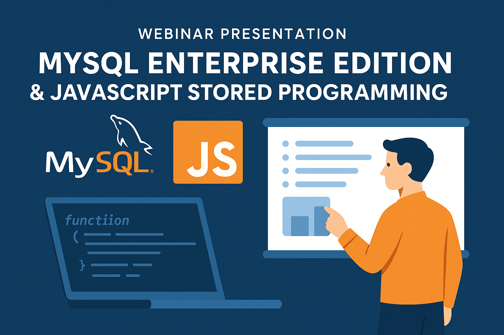

##  MySQL Enterprise Edition JavaScript stored programming

This repository contains the slide deck and supporting materials used during a webinar focused on MySQL Enterprise Edition and the introduction of JavaScript stored programming, a new feature available starting with MySQL 9.0.

**Webinar Objectives**

	•	Provide an overview of key features available in MySQL Enterprise Edition.
	•	Understand common use cases for stored programming in MySQL.
	•	Explore the integration of JavaScript as a language for creating stored procedures, functions, and triggers.
	•	Compare the capabilities of SQL, SQL/PSM, and JavaScript for stored logic.
	•	Demonstrate practical examples and best practices.

---
## ✅ Ressources

▶️ [MySQL Stored programming](https://dev.mysql.com/doc/refman/9.3/en/stored-objects.html )

▶️ [MySQL Javascript store programming](https://dev.mysql.com/doc/refman/9.3/en/stored-routines-js.html)

▶️ [MySQL JavaScript examples from manual](https://dev.mysql.com/doc/refman/9.3/en/srjs-examples.html)

▶️ [MySQL JavaScript example: MySQL vector operations](https://lefred.be/content/mysql-vector-datatype-create-your-operations-part-1/)

▶️ [MySQL JavaScript example: UUID](https://blogs.oracle.com/mysql/post/javascript-support-in-mysql-the-uuid-example)

---
<table>
<tr style="border: 0px transparent">
	<td style="border: 0px transparent"><a href="../README.md" title="home">🏠</a></td>
</tr>
</tr>

</table>
