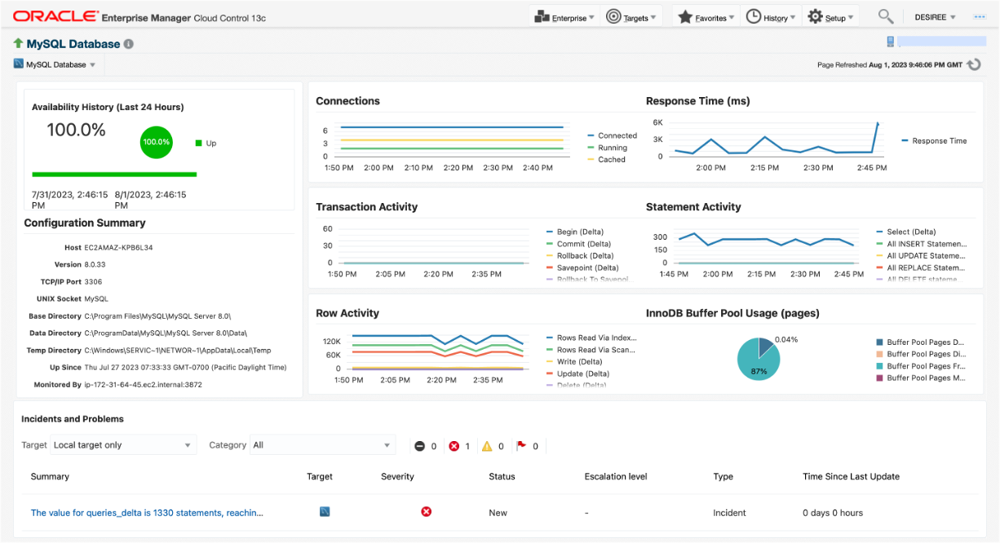

 

##  MySQL Monitoring with Oracle Enterprise Manager Plugin

Effective monitoring and observability of a MySQL database is critical to ensuring its performance, stability, and security. In this session, you'll learn about what’s new, key metrics to monitor in MySQL and best practices for observability and troubleshooting. 
 
We'll explore how the new MySQL monitoring plugin for Oracle Enterprise Manager enables observability on the various aspects of MySQL performance, such as CPU utilization, memory usage, disk I/O, query performance and high availability. By the end of this session, you'll have a comprehensive understanding of how to effectively monitor and maintain the health of your MySQL database and how to identify common performance issues.
 

---
<table>
<tr style="border: 0px transparent">
	<td style="border: 0px transparent"><a href="../README.md" title="home">🏠</a></td>
</tr>
</tr>

</table>