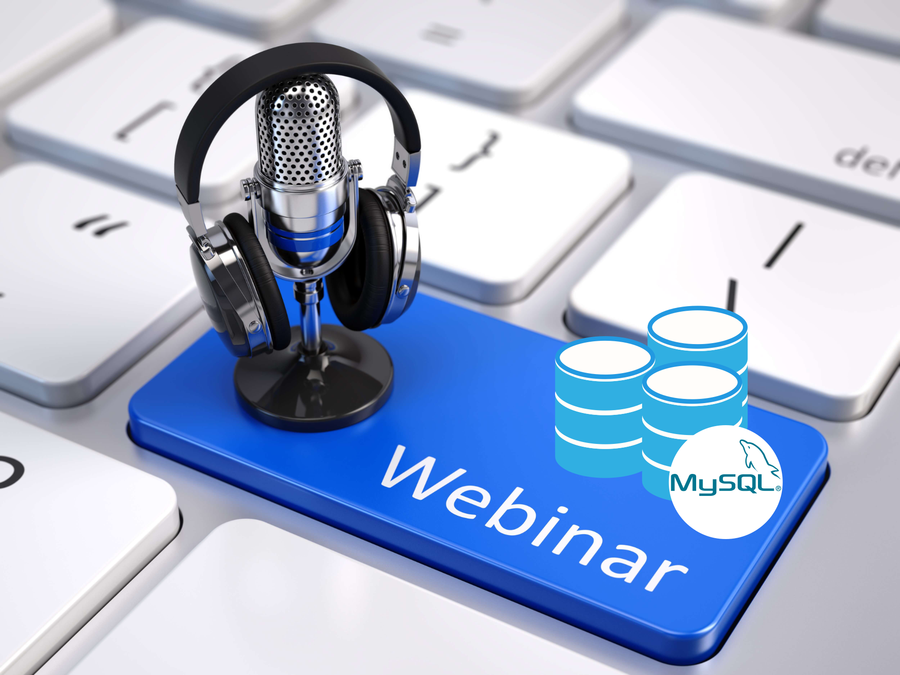

# Webinar Repository

Welcome to the MySQL Webinar Repository! This repository serves as a central hub for various webinars focusing on different topics, providing resources and materials related to each session. 

## Webinars

### MySQL High Availability, Scalability, and Disaster Recovery

**Description**:  
This presentation provides comprehensive guidance on establishing a high availability (HA) and disaster recovery (DR) framework within your enterprise, leveraging the robust capabilities of MySQL. It will also explain how to effectively scale your MySQL applications.

### Repository Structure

- [`MySQL_HA`](MySQL_HA): Contains materials related to the MySQL High Availability, Scalability, and Disaster Recovery webinar, including presentation slides, sample code, and additional resources.
- [`MySQL_Beginner`](MySQL_Beginner_FR): Contains materials related to the MySQL for Beginners,including presentation slides, sample code, and additional resources.
- [`MySQL_PERF`](MySQL_PERF): Contains materials related to the Fine Tuning MySQL For Your Business Needs,including presentation slides.

## Getting Involved

We invite you to explore the resources available in this repository. If you have any questions, suggestions, or contributions, please feel free to reach out or submit a pull request!

## License

This project is licensed under the MIT License. See the [LICENSE](LICENSE) file for details.

## Contact

For any inquiries, please contact **Emmanuel COLUSSI** at .

Thank you for visiting the Webinar Repository!
